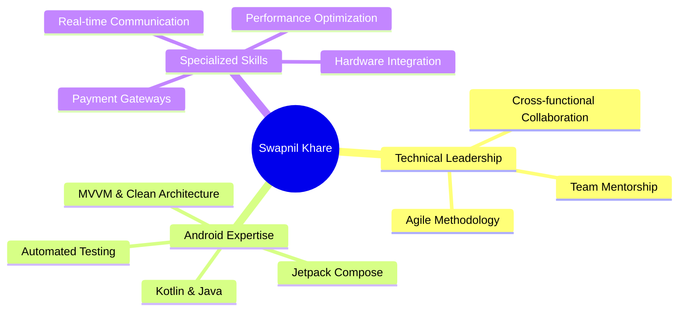
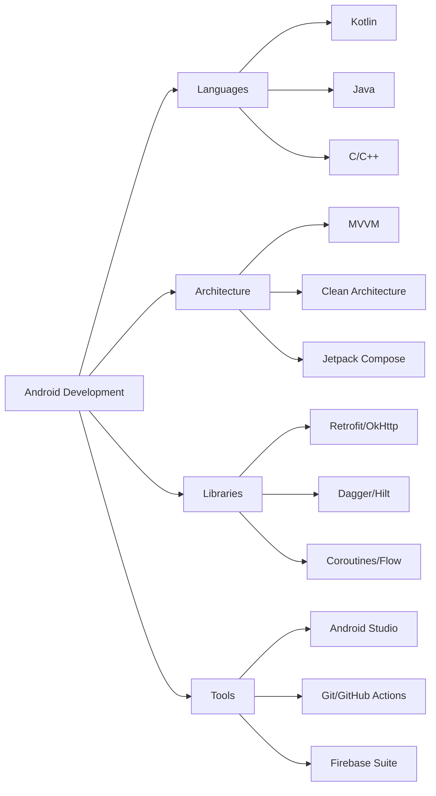
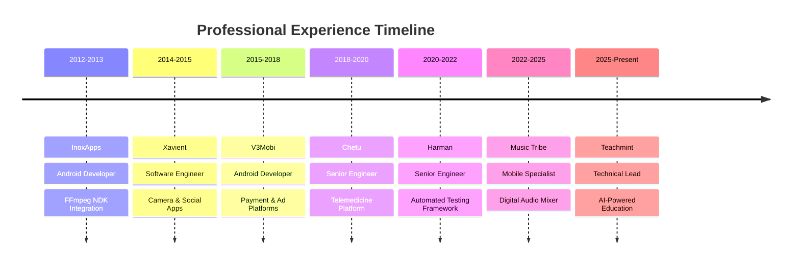
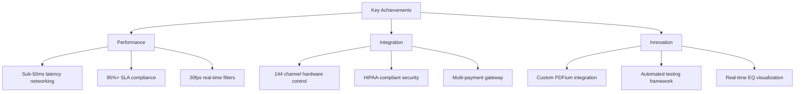
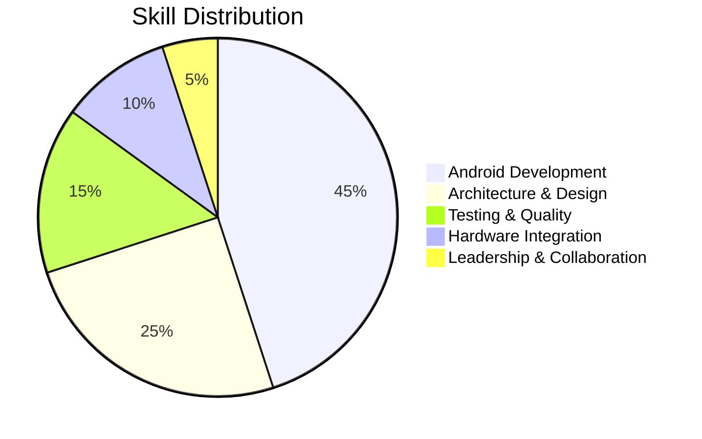

# Hi there, I'm Swapnil Khare 👋

## 🚀 About Me

**Android Technical Lead** with **10+ years** of experience building high-performance mobile applications across healthcare, enterprise, and entertainment domains. Passionate about clean architecture, modern Android development, and creating seamless user experiences.

## 💼 Current Role

**Technical Lead @ Teachmint** _(Aug 2025 - Present)_
- Leading AI-powered classroom platform serving thousands of educators
- Architected custom image caching for optimized data sync
- Maintained 95%+ SLA compliance with rapid issue resolution

## 🛠️ Tech Stack

**Core:** Kotlin • Java • C/C++ • Python

**Android:** SDK/NDK • Jetpack Compose • MVVM • Clean Architecture • Room • DataBinding

**Testing:** Espresso • JUnit • Mockito • Instrumented Tests

**Networking:** Retrofit • OkHttp • Kotlin Coroutines • Flow

**DI & Reactive:** Dagger • Hilt • RxJava

**Real-time & Hardware:** ZeroMQ • Agora SDK • Media Projection API

**Payments:** Stripe • Google Pay • Shopify SDK

**Firebase:** Authentication • Realtime Database • Cloud Messaging • Crashlytics • Analytics

**DevOps:** Git • GitHub Actions • Bamboo • ADB • Shell Scripting

**AI Tools:** Claude CLI • GitHub Copilot

## 📊 Career Journey

## 🏆 Highlighted Projects

### 📱 Featured Apps

| Project | Description | Tech Stack | Link |
|---------|-------------|------------|------|
| **Teachmint IFP** | AI-powered classroom platform with EduAI assistant | Kotlin, Compose, MVVM, Firebase | [Play Store](https://play.google.com/store/apps/details?id=com.teachmint.teachmint) |
| **Digital Audio Mixer** | Professional controller for Midas HD96 mixer | Kotlin, ZeroMQ, Custom Views | [Play Store](https://play.google.com/store/apps/details?id=com.musictribe.hdmix) |
| **Healthcare Platform** | Telemedicine app with video consultations | Kotlin, Agora SDK, MVP, Firebase | Private |
| **Live Jukebox** | Music request platform with payments | Kotlin, MVVM, Stripe, Google Pay | Private |

### 🎯 Key Achievements

- ⚡ **Sub-50ms latency** for real-time mixer control via ZeroMQ
- 🎵 **144 input channels** hardware integration for professional audio
- 🏥 **HIPAA-compliant** telemedicine platform with Agora SDK
- 🤖 **Automated testing framework** reducing regression test time
- 📊 **95%+ SLA** maintenance with rapid issue resolution
- 🎬 **FFmpeg NDK** porting with 20+ video effects

## 💡 Technical Expertise

### Architecture Patterns
- Clean Architecture with multi-module approach
- MVVM with Repository pattern
- MVP for legacy codebases
- Reactive programming with Coroutines & Flow

### Specialized Integrations
- Real-time video/audio communication (Agora SDK)
- Hardware control protocols (ZeroMQ, custom APIs)
- Payment gateways (Stripe, Google Pay, Shopify)
- NDK for native code optimization

### Testing & Quality
- Espresso for UI automation
- JUnit & Mockito for unit testing
- CI/CD pipelines with GitHub Actions & Bamboo
- Shell script automation

## 📈 GitHub Stats

## 🎓 Education

**Bachelor of Engineering in Electronics and Communications**  
RGPV University, Madhya Pradesh | 2010

## 📫 Let's Connect

- 💼 [LinkedIn](https://linkedin.com/in/swapnildroid)
- 📧 [Email](mailto:swapnil.droid@gmail.com)
- 🌍 Location: Bengaluru, Karnataka, India

---

### "Building innovative mobile experiences, one line of code at a time" 💻

